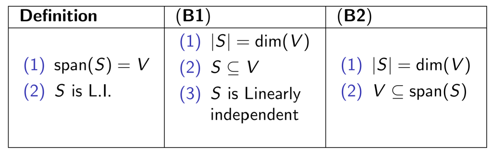

## Algorithm to compute the Relative Coordinates
For a set of vectors $S = \{u_1, u_2, \ldots u_k\}$ which is a basis for the subspace $V$, where $u_i$ is a column vector in $\mathbb{R}^n$
- What can we conclude?
- purpose of forming matrix $\implies$ enables us to compute relative coordinates
- we have finitely many **basis** vectors

We can find $[v]_s$ by finding the coefficient of the unknowns.

### Section 3.6 Question 1 Part 1
Suppose non-pivot column on LHS of the RREF form of 
$$
\begin{pmatrix}u_1 & u_2 & \ldots & u_k \: | \: v\end{pmatrix}
$$
has non-pivot columns. What can we conclude?

We can make the $RHS = 0$ and therefore there are multiple solutions to $\begin{pmatrix}u_1 & u_2 & \ldots & u_n \: | \: 0\end{pmatrix}$ 
- can conclude that $S$ is linearly dependent

Check the consistency of the system $\implies$ can conclude that it is a basis, but **cannot** conclude that it spans the subspace $V$

### Section 3.6 Question 1 Part 2
Suppose 
$$
\begin{pmatrix}u_1 & u_2 & \ldots & u_k \: | \: v\end{pmatrix}
$$
is inconsistent and $v \in V$ What can we conclude?

We can conclude that there may be a vector $m$ in span(V), but there are no solutions

## Coordinates relative to basis
- the linear combination $v = c_1u_1 + c_2u_2 + \ldots + c_ku_k$ is a unique expression
### Section 3.6 Question 2 Part 1
- calculate coordinates, then calculate linear combination, or vice versa both works.

**Proof**
$\implies$
- If $u$ and $v$ have the same coordinates then they are the same vector

$\impliedby$
- If they are the same vector, then they have the same coordinates for the linear combination?

### Section 3.6 Question 2 Part 2
Rewrite $v_1$ and $v_2$ in terms of their linear combinations
- then we do $c_1v_1 + c_2v_2 = \ldots$
## Basis
> Let $V$ be the subspace of $\mathbb{R}^n$. A set $S = \{u_1, u_2, \ldots u_k\} \subseteq V$ is a **basis** vector if
> (i) $S$ spans $V$, $Span(S) = V$
> (ii) $S$ is linearly independent
- for basis $S$, $\forall V \in \mathbb{R}^{2 \times 2} \implies$ can be written uniquely as a linear combinations of vectors in $S$
	- the basis $S$ needs to be linearly independent

### Challenge in Section 3.6
- vector space which is not in the Euclidean vector space (i.e. $\mathbb{R}^n$)
- writing the vector in a square form instead of a vector

- $\mathbb{R}^{2 \times 2}$ is in the abstract vector space
- need to check the conditions for basis one at a time
	- span
	- linear independence

Proof for Linear independence is almost always the same
- start from linear combination $= 0_{2 \times 2} = 0_2$
- Zero matrix of order $2$

## Dimension
- In the vector subspace $V$ and we have basis $S = \{u_1, u_2, \ldots u_k\}$ and basis $T = \{v_1, v_2, \ldots v_m\}$, then $|S| = |T|$ and $k = m$
	- bases is the plural form of basis.
- dimension of $V$, denoted as $dim(V)$ is defined to be the # vectors in any basis of V
- if two spaces have the same dimension, then they are isomorphic

## Spanning Set Theorem
Suppose $S$ spans the whole space, then we can cherry pick some elements in $S$ to form a basis
- sufficient to find a subcollection which is the basis (i.e. $\{u_{ii}, u_{ij}, \ldots u_{im}\} \subseteq \{u_1, u_2, \ldots u_k\}$ )
- the basis is the smallest spanning set (i.e. the set which spans the subspace)

## Linear Independence Theorem
- start with linearly independent subset of V. Then the basis of V includes the subset
- Both Spanning Set and Linear Independence Theorem **relate to** the two conditions in the defn of basis.
	- Basis is the smallest spanning set AND the largest linearly independent set.

### Challenge in Section 3.7
Prove that $S \subseteq V$, if $k$ vectors $- |S| = k$ where $V$ is a $k$-dimensional subspace of $\mathbb{R}^n$
- can use invertibility $\implies$ need to use coordinate space of $\mathbb{R}^k$
	- look at $11$ equivalent statements of invertibility $\implies$ from $8$ in the earlier part of Section 2
		- (9) the determinant of the matrix provides a "sign", whether the matrix is invertible
		- (10) and (11)

- Not advisable: Turn vector in $S$ as some column vectors
	- Instead use the concept of dimension

**Proof**
$\implies$
- use linear independence theorem
- $\exists$ a basis where $T \supseteq S$
- $|S| = dim\: V = k = |S| \implies S = T$ **and** $span(S) = span(T) = V$

$\impliedby$
- use spanning set theorem
- $\exists$ a basis where $U \subseteq S$
- Then $|U| = k = dim\: V = |S| \implies S = U$ and $S$ is linearly independent

## Equivalent ways to check for basis
The purpose: We are trying to check if $S$ is a **basis**
1. From independence, we obtain that $S$ is a basis (i.e. $span(S) = V$)
2. From span, we obtain that $S$ is a basis (i.e. $V \subseteq span(S)$)

How about we are provided additional info:
$$
dim \: V = k = |S|
$$
- know the dimension of the whole space
- know the # vectors in $S$ or cardinality of $S$
- Then we only need to check **either (1) or (2)**
#### Summary of conditions

## Transition Matrices
Notation: $P_{S \to T}$ 
- where S and T are basis vectors
- transit the coordinates from $S$ to $T$

$[v_1]_s$ is the coordinate of $v_1$ in relation to the basis $S$.
- can transform to basis of $T$, then we just use $[w]_S$

## Algorithm to obtain transition matrix
- $S$ is basis, system must have unique solution and the RREF of the augmented matrix is in the form:
$$
\left( \begin{array}{c|cccc} I_k & [\mathbf{v}_1{}]_S & [\mathbf{v}_2{}]_S & \cdots & [\mathbf{v}_k{]}_S \\  \mathbf{0}_{(n-k) \times k} & 0 & 0 & \cdots & 0 \end{array} \right) = \left( \begin{array}{c|c} I_k & \mathbf{P} \\  \mathbf{0}_{(n-k) \times k} & 0_{(n-k) \times k} \end{array} \right)
$$
### Challenge in Section 3.8
**Suggested Solution**
- rewrite $v$ as a linear combination of the elements in both the bases $S$ and $T$
- post multiply both sides by $P_{S \to T}$, since we already have $P_{T \to S}$ and that $P_{T \to S} \cdot P_{S \to T} = \textbf{I}$ 
- $\textbf{I}$ is a square matrix, conclude that it is invertible with an inverse

**Alternative Solution**
Let $Q$ be a transition matrix from $S \to T$.
- do lots of e.r.o., which corresponds to pre-multiplying by a series of elementary matrices
- $\exists E$ is a square matrix with all the row operations
	- $\exists E$ s.t. $\: ES = \begin{pmatrix}I_k \\ 0\end{pmatrix}$ and $\: ET = \begin{pmatrix}\textbf{P} \\ 0\end{pmatrix}$

- from $\begin{pmatrix} \text{"T"} \; | \; \text{"S"} \end{pmatrix} = \begin{pmatrix} \begin{array}{c|c} \textbf{I} & \textbf{Q} \\ \textbf{0} & \textbf{0} \end{array} \end{pmatrix}$
- Then multiply $ET \cdot FS$